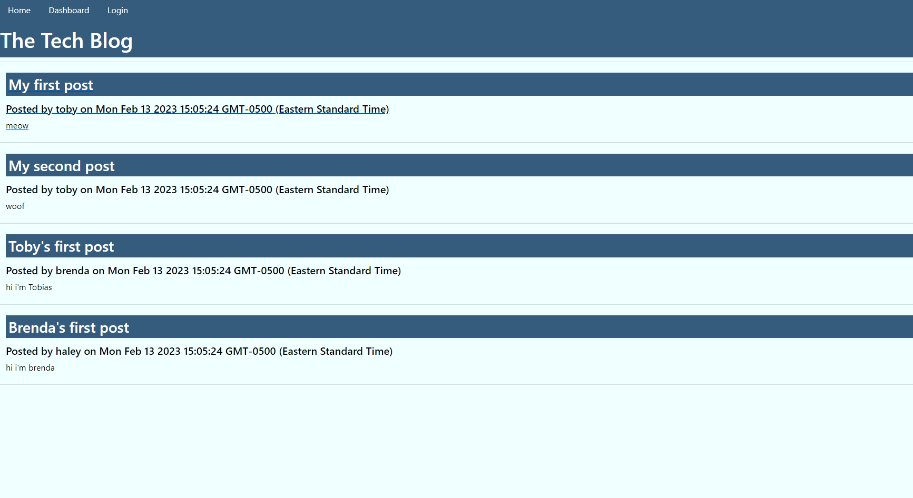

# MVC-tech-blog

## Description
---
This project is a blog site for developers! The motivation for this project was to create a blog where tech fans can share their thoughts

## Usage 
---
After following the instructions in installation: 
1. Open the database file in your terminal. 
2. Run command "mysql -uroot -p" and enter your password (note: keystrokes will not show).
3. Open the "server.js" file in your integrated terminal. 
4. Run command "npm run seed" (or "node seeds/index.js") to seed the database if desired.
5. Run command "npm run start" (or "node server.js"). Alternatively, if you have Nodemon installed, run "npm run watch" (or "nodemon server.js"). 

